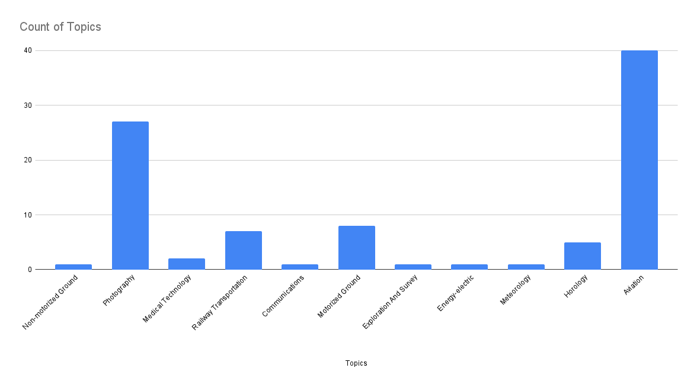
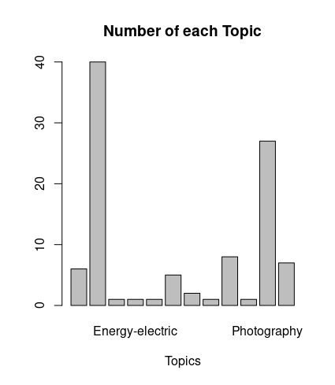
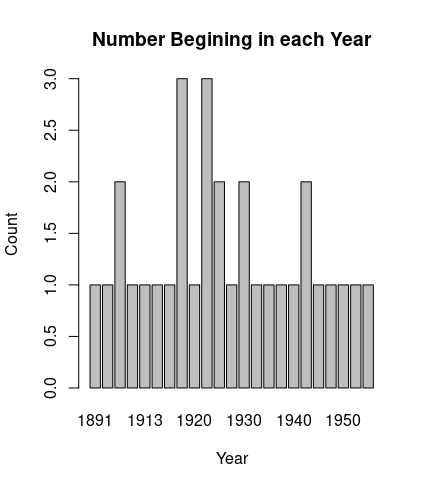
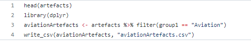
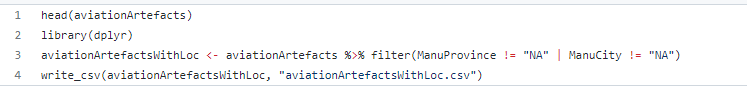
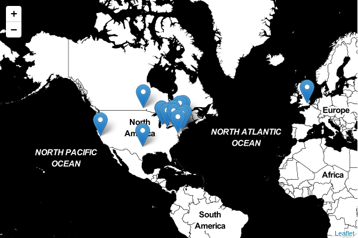

The Tutorials I used to make this piece of Digital History:
 
1. OpenRefine Tutorial https://craftingdh.netlify.app/tutorials/open-refine/
2. Excel & R Tutorial https://craftingdh.netlify.app/tutorials/excel/
3. Cleaning and Manipulating Data with R https://craftingdh.netlify.app/tutorials/clean-data-r/
4. Web-mapping with Leaflet https://craftingdh.netlify.app/tutorials/mapping/
5. Static Websites https://craftingdh.netlify.app/tutorials/static-websites/
 
# How foreign influence shaped Canada's Aviation Industry
By Dustin Doyle, Proof Read by Dianna Gardner
 
## Obtaining the Data
 
The topic I chose to investigate was aviation artifacts. Thus to do this I started by going to [Ingenium Canada](https://ingeniumcanada.org/collection-research/artifact-open-data-set-mash-up). From this website I would download the csv file which contains a spreadsheet of all artifacts in the collection's of The Canada Agriculture and Food Museum, Canada Aviation and Space Museum, and lastly The Canada Science and Technology Museum. However I would run into a major issue downloading this csv file. It turned out when I clicked onto the download link it would redirect me to a new temp page then close like what normally happens when you click on a download link. However the download never started like normal, meaning it never downloaded the csv file. I thought that maybe the link was just broken so instead I tried the xml file. However with this I ran into a new problem. The xml file, instead of being only 69MB, was 318MB while I only had around 200MB's left on my VM. But to my surprise instead of starting a download when you click on the xml download link you are sent to a webpage filled with what appears to be in a csv file format. When you right clicked then selected save as from the drop down menu it would save as a xml file which makes sense. But I thought to myself, wait a minute I can copy and paste the text from the webpage into a csv file. After all, it's already in csv file format. So I hit Ctrl a, then Ctrl c, went into VSCode which is the text editor I use on my VM and hit Ctrl v. This however ended up pasting everything onto one line, and not even pasting all of the information just a small portion of it. This left me with one option and that was to just download the xml file. Since I didn't have the space on my VM I downloaded the xml file onto my PC. From here I planned to turn the xml file into a csv file then post it to my Github repo so that I can get the data onto my VM. I however did not know how to do this thus I googled How to convert an xml file to csv file and found this article: [xml to csv](https://knowledge.kaltura.com/help/how-to-convert-an-xml-document-to-csv-file-or-excel-spreadsheet). However very quickly I ran into some issues as in the second step it had me edit the xml file in a text editor. However the xml I had did not share the same file structure shown in the article. Thus I could not remove the first two lines before saving the file as an xml file again. So I tried to go solo and attempted to open the file in both Excel and Google Spreadsheets. However I ran into another problem, both Excel and spread could not open the file. I searched around google for the issue and it appears to most likely be due to the size of the xml file. Thus I found myself stuck once again. It was now late at night so I decided to post about my troubles on Discord before going to bed. In the morning however professor Graham responded to me in Discord asking me to specify the issue to help solve the problem, suggesting it was probably a security issue. He also posted an alternative download link for the csv which worked. But in order to learn what the problem is I decided to do a bit of trouble shooting based on Graham's suggestion that it could be a web browser security settings issue. He asked if I was using Firefox which I was not, however I was using Brave, a sort of Google Chrome clone but with additional security settings. Thus why I suspected Brave was the issue. So I tried Google Chrome, however it did not work. Which looking back I realized that I first tried to download the csv file on the VM using Google Chrome not Brave. Next I tried Internet Explorer, and of course it worked. Thus it was safe to conclude it was most likely security settings since Internet Explorer is pretty famous for having bad security, and just being out of date in general. Though that said it is still possible there could have been some other reason like the website needing a no longer supported tool that was deleted to save space in newer updates. But then again the most likely cause for changes like this are better replacement tools with additional security. Thus even then better security is likely one of the factors for the removal of these old tools which could break the links support. But given that the web page function is a download link it is likely this is a security improvement to try and prevent users from downloading suspicious scripts from links on the web which could contain viruses and malware. Honestly it's pretty scary to think that clicking on the wrong link can basically end up bricking your computer for good, or getting all your data stolen without giving you the chance to fix it. As some scripts can run automatically once downloaded due to various programs and exploits. But side tracking out of the way I ended up downloading the file to my VM without any further issues. I should note that the file was miss spelled as artefacts.csv, thus I ended up using this miss spelled version throughout all my work. Though I will try to reference the correct spelling when not quoting the files.
 
## Cleaning the Data
 
Next I need to clean this data. This will be using the OpenRefine Tutorial, and its various functions. To do this I opened up artefacts.csv with OpenRefine. Thus I began cleaning artefacts.csv by using Facet drop down Text Facet tool. This creates a collection of all unique rows of text throughout the selected column and counts the number of times each time a row of text is repeated. Using these collections we can apply the clustering tool on them. This clustering tool clusters together all similar groups of texts together in the facet collection. This is all based on the currently selected clustering algorithm which you can change. For cleaning my data I tried all of the default cluster options in OpenRefine. Then for each of these clusters it suggests a new line of text to change all of the rows in the cluster to. However it should be noted that you can type in that name manually and also select only the clusters you want to change, and even the individual lines of text inside of the cluster. This is great Since the clustering algorithms are not one hundred percent accurate at figuring out your intentions for what you want to cluster. Thus you need to go over and check all of the clusters manually to make sure it's correct. In my case I didn't have many clusters needed with the data. I had only one cluster in GeneralDescription for example, but I did have a lot of incorrect false positives in the material section. After going through and clustering everything I moved onto capitalization of the data columns, as I noticed some entries were in upper case and others were in lower. Though I tried to match with the most common capitalization format of that column. I then forced all rows in the selected column to be uppercase, lowercase, or titlecase meaning uppercase leading letter with lowercase following letters. Honestly I probably should have just stuck with one case and changed all columns as that would likely look better then what I have. In the end I have some lowercase, some uppercase, some titlecase, and some mixed columns. I think at the time I was doing this because I wanted NA to be uppercase but wanted none NA answers to be in lowercase which is why I have some mixed rows. This means despite cleaning things up the data can look messy at times. Then I went through every column using the trim leading and trailing whitespace tool to ensure no further clean things up. After looking through everything one last time and not seeing any glaring issues I exported my cleaned data as artefactsCleaned.csv. However it wasn't until way later that I noticed there were still errors in my data like Québec and Montréal while doing some data manipulation with R. It's likely these are not the only issues in the data and I have missed a few more issues in it. Though in the end for the analysis I have done these issues have not caused me any problems to my knowledge. Though if I were to continue analyzing this data I might want to go back over and clean things up more.
 
## Analysis using Excel and R
 
Now that I had my cleaned data in my artefactsCleaned.csv file I can begin doing some analysis on the data. To do this I will be using the Excel and R tutorials. First using google spreadsheets I counted each of the topics in the data.
 

 
As I am interested in looking at the aviation data this graph allows me to quickly determine how useful this data will be to me. We know from the number of entries in spreadsheets that there are hundred artifacts, and from this graph we can determine that forty of those are aviation related with the second most popular topic being photography with approximately twenty six artifacts. However we can see that there are nine other topics all having less than ten artifacts under that topic. Thus we can conclude that this data is sufficient for my topic of interest which is aviation. However if one were to try and use this data for another topic of their interest the only one with more then ten artifacts is photography. Thus it's likely this data set is only going to be useful for someone looking at Aviation or Photography if you are just interested in artifacts from a single topic like me. Next I used the R part of the tutorial to make the exact same graph that I made in google spreadsheets.
 

 
We can see that R gave us nearly the exact same results but with one important difference. Though the counts of the topics are all the same you will notice however that there are twelve columns on this plot compared to the eleven with google spreadsheets. At first you may suspect that this plot in R is incorrect, however both are correct. The reason for the discrepancy is that the R graph included empty spaces as a separate column of their own. But in google spreadsheets these are not a part of the count likely because if one were to name that column it would be blank. But since the R graph does not care as it does not need to label the columns, thus this is not an issue. However it should be noted that we can alter the R code slightly to exclude empty rows from the graph. However idk if we can alter google spreadsheets graph to do the same as I do not have enough knowledge on how google spreadsheets works. My guess is that we would need to either manually fill the empty rows or use some tool to auto fill the empty rows with a value such as NA to count empty rows in google spreadsheets. Also it's interesting to note that the R plot only shows us the names of two columns Energy-electric and Photography. These two columns are strange picks for what columns the R graph decided to name in the plot. That said, since it is R, I can likely change some settings for the plot in the code in order to include all column names. Though even without having all of the columns names I was able to learn that there are artifacts that have not been assigned a topic which is something my spreadsheets graph missed. Thus this graph was very helpful as it revealed otherwise hidden characteristics of the data that the previous graph missed. Now onto the other graph I made in R.
 

 
The main reason I created this second graph was to test my R skills, but that said good analysis can still be made of this graph. For example we can see the begin dates for the artifacts are very spread out. There are only a few artifacts sharing the same beginning date. There are only two years being shared by three different artifacts and then only four years being shared twice my two artifacts. While the range of years goes from 1891 to over 1950. Thus we can see these artifacts are from a fairly wide period of time. This graph also has some issues like that last one with the graphs not being the prettiest. This time however it's not just the plotting settings but my own mistakes. There is the poor title I chose for the graph of "Number Begining in each Year" Which should be "Number of artifacts Beginning in each Year". Then the Y axis title of "Count". If I were to rename the Y axis title I would call it "number of artifacts" or "number of artifacts beginning in year". The only issue I had with the plotting algorithm was the use of 0.5 increments when it is not possible to have half values for the artifacts begin date. This was likely because the graph wants to display the info in a certain sized graph. Thus the graphing algorithm likely automatically selected this increment to increase the height of the graph as otherwise it would just have 4 data points 0,1,2,3. However we can see that the R graphing tool did not include any of the years which did not have any artifacts beginning in that year since there are only 23 column aka years shown here despite the over 60 year difference in beginning years displayed between them. This of course would mean a lot of empty columns. Thus the algorithm likely decided it would be better to not bother including all of those blank gaps in the data.
 
## Creating a new csv file for only aviation artifacts
 
Now that we have done a bit of analysis we know that this data will be useful to us as we have forty aviation based artifacts. However as we are only interested in aviation artifacts for the remaining analysis I will be using the Cleaning and Manipulating Data with R tutorial to get a csv containing only aviation artifacts. To do this I made another script in R using a filter which we learned how to use in this tutorial. For a quick explanation of filters in R they are used to read in data with a specified list of instructions to extract a portion of that data based on that list of rules. Then taking the data extracted with the filter I used the write_csv command to create a csv file filled by the data from the filter. For example of what this looks like here is my complete code.
 

 
It should be noted that I used the import options in RStudio to import the data into the work environment instead of using a command to fetch the data. Thus if you want to reproduce the results you will need to do the same or add in that fetch command. Next the line **library(dplyr)** imports the needed commands for the upcoming part such as the filter command. Then **aviationArtefacts <- artefacts %>% filter(group1 == "Aviation")** this line contains the filter which extracts data from artefacts.csv using the filter which searches the column group1 looking for a row that equals the string Aviation. If found to be equal the entire row will be sent to the new variable aviationArtefacts. Sense each artifact is represented by a row this means each artifact which belongs to the topic of Aviation will be saved to this new variable. The next line is **write_csv(aviationArtefacts, "aviationArtefacts.csv")**, which creates the file aviationArtefacts.csv filled with the data of variable aviationArtefacts.csv. However once I looked into my data I noticed not all artifacts have locations to them thus requiring me to make this second R script to filter and save a new csv file, which only had Aviation Artifacts with locations so I can map them in the next part of this project.
 

 
This is basically the same as before but with a more advanced filter as it checks two columns in artefacts.csv to see if either of them have a location aka a none "NA" entry. Thus we create a new csv file from aviationArtefacts.csv which has all aviation artifacts that have a location for either the province or city. With this new file we are now ready to map the aviation artifacts onto a map.
 
## Mapping the location of Aviation Artifacts across the world
 
Taking this csv file that contained all artifacts with locations whether this was just a city or a province/state, I wanted to plot them onto the world map. To do this I used the Web-mapping with Leaflets tutorial. This part of the project was by far the most time consuming. First I began by reviewing the code provided to us in the tutorial. I copied and pasted in the complete web-map folder from part three of this course which contained all of the code and all the resources needed to run the web map we made in part three. The first file I started altering was the World-map.html file. I then looked for the line of code where we added the overlapped map. From there I commented out the line to remove it from the map, as all I wanted was labeled artifacts locations. Next as I did not want animated location pointers I removed the animated marker code. This would remove the animated marker which moves across the downtown Ottawa area. Now we finally had a nice and simple map, however it was still zoomed in to downtown Ottawa and I wanted to display the globe. Thus I needed to zoom out the image a lot. To do this I found the myMap variable in the code which held some basic information about my map such as its center and zoom. I didn't really care about the center as we are looking at mostly North American artifacts. Thus I left it, but for the zoom I changed it to 1 which zoomed out the map to show most of the globe in image image. Now my map was ready I just needed to remove our current markers and add new ones to represent the locations of our artifacts. To do this I would need to start altering the point-data.geojson which houses all the information for the map markers. I just used the same markers layout that we used in the tutorial but changed the markers locations, and labels. I then manually had to type in each marker's information one by one. This would have been fairly simple but the data did not provide coordinates, only location names. Lucky for me however was that all locations had at least named a city and country, while most also had their province/state. Thus I was able to search on google maps all of the artifacts city names in the correct nations and provinces/states for most artifacts to find its approximate coordinates. However there was one data point where I needed to take a bit of a guess and that was Hayes England. As no province/state was specified, luckily there was only one Hayes in England thus it was a very safe guess. The way I approximated the city coordinates was after google maps redirected me to the city I clicked around the city center for a specific location that I could set my markers location to. I also noticed that google maps gave me the coordinates in opposite order to the way Leaflets wanted them thus googles X coordinate as Leaflets Y coordinate, and googles Y coordinate as Leaflets X coordinate. This all took a really long time to do but finally it created this map:
 

 
This map reveals to us some important information, such as almost all of these three Canadian museums' aviation artifacts locations are clustered around the north east US, with only a few of these artifacts from southeast Canada. There is only one non-North American artifact and that is the artifact from Hayes England. This is pretty interesting to note as these are all specifically Canadian museums, all of them are called the Canada "topic" museum. Thus you would expect there to be a strong bias towards specifically Canadian artifacts and information.
 
## What does this finding mean
 
Finding that the vast majority of aviation artifacts in Canadian museums comes from the US has some interesting implications. Mainly the role and effects of American aviation in Canadian aviation. Like many things between Canada and the US this map makes it very apparent how much the US influences Canada, and in this case in particular Canadian aviation. To explain why this is we will need to look into what these artifacts are. Most of these artifacts in the collection are airplane parts with one even being a whole airplane. We can see however almost all these parts were designed and made in the US by US companies. We can see by looking at the aviationArtefactsWithLoc.csv file that the complete airplane in the collection is the model Northrop Delta, made in Montreal Canada by the company Canadian Vickers Ltd. However looking into things more closely you will quickly realize the international connections of this airplane. First off is the American influence on this airplane, the model of Northrop Delta, to those like me you're probably saying wait a minute isn't Northrop that massive company in the US? I thought the same so I went to google and searched up the Northrop Delta going to the [Northrop Delta wiki Page](https://en.wikipedia.org/wiki/Northrop_Delta). Looking at this page you find the Manufacturer Northrop Corporation. Clicking on the name will send you to the [Northrop Corporation wiki Page](https://en.wikipedia.org/wiki/Northrop_Corporation). The first thing you will see at the top of the page is "Northrop Corporation was an American aircraft manufacturer from its formation in 1939 until its 1994 merger with Grumman to form Northrop Grumman.". Thus my suspicion was correct. This is the same famous US company which designed this plane that was built in Canada. Though that's not the only foreign source of influence on this aircraft there is also the British influence. The reason for this is that the company building the plane in Canada was Canadian Vickers Ltd. When we check [Canadian Vickers wiki page](https://en.wikipedia.org/wiki/Canadian_Vickers) once again we find that this is a subsidiary of Vickers Ltd, which to be fair we could likely tell from the name. This is important because [Vickers Ltd](https://en.wikipedia.org/wiki/Vickers_Limited) is a very large and famous British company. Thus we can see that despite being built in Canada by Canadians this plane is also of American design and a product of a british building company. Thus this plane greatly embodies the sort of relations we see in the Canadian aviation industry. Though Canada has an aviation industry it's mostly not a self sufficient industry but one that is highly dependent on the US and British aviation industries. So we have now established how intertwined our aviation industry is with mainly the US, but also a bit of Britain's aviation industry. Thus we will now look at why this is and the effects, which of course are related to each other. I will be referencing the [History of aviation in Canada wiki page](https://en.wikipedia.org/wiki/History_of_aviation_in_Canada) quote a bit for this part. This wiki page mentions a few very early and highly experimental planes tested prior to World War One but generally speaking World War One was when the aviation industry started in Canada. The wiki mentions "Curtiss Aeroplane and Motor Company" which is a US company that started a plant in Toronto. This is likely one of the first sizable aviation ventures in Canada. Then in the interwar period the wiki also mentions a small but blooming aviation sector which was based heavily on US and British aircraft and aviation companies. Then by far the main thing that created the fairly large aviation industry of Canada today is World War Two. In World War Two we saw an explosion in the Canadian aviation industry where Canada mass produced both British and American planes for the allies. Following World War Two the Canadian Aviation industry shrunk especially in the military aviation industry, but we still maintained an above average aviation industry which remained heavily intertwined with both the US and British industries. However post World War Two only a few major British aviation companies remained in Canada one of which being the infamous Avro Canada. As time has gone on however most of these British companies have failed and been absorbed into other companies thus there is minimal British influence in Canada's aviation industry today. But remember our data isn't from today's aviation industry, it is from 1920-1942, where the share of influence between US and Britain on Canadian aviation was fairly balanced, though more commonly in different ways. The US mainly influenced Canadian aviation with physical parts while Britain did the same as well. They mainly created branches of British companies in Canada, of course the US did as well, just not as much as Britain at that time. My guess for this is due to the fact that Canada is located so far away from Britain that manufacturing of parts in Britain would need to be shipped to Canada across an entire ocean. Thus being mostly illogical, while the US was close by with a large working force, thus they could build more stuff and get it to Canada far sooner and cheaper making it the more logical choice. For the companies being dominated by the British my guess is due to the military procurement at the time, as Canada was building mostly British military plane designs at the time. Thus Canada produced British military planes with the benefits of the US industry allowing for Canada to have a very effective aviation industry with minimal complications. As we did not need to go through the long process of making aviation companies from scratch with no prior history, instead Canada used the experience and skills of both the US and Britain to kick start our aviation industry which still remains fairly large today. Thus this map has demonstrated to us an important part of the construction of the Canadian aviation industry. Showing us that without their influence Canada's aviation industry today would likely be tiny as Canada would need to pump so much more money and resources to make up for the lack of US and British assistance during this time.
 
## Connecting this project to the course readings
 
In my analysis I relied heavily on the wiki which embodies the use of crowd sourced work. This relates to the paper we read in class ["Making such bargain"](https://melissaterras.org/2018/08/29/new-paper-making-such-bargain-transcribe-bentham-and-the-quality-and-cost-effectiveness-of-crowdsourced-transcription/), which talks about the use of crowd sourced work. The Two main questions the paper looks to answer about crowd sourced work is if can provide a satisfactory standard of work, and if it is financially logical. At least in my words but in case of I have miss understanding and have made an error here is their words: [Question One](https://hyp.is/Sd6nLO36EeyWxActEBEdNQ/melissaterras.org/2018/08/29/new-paper-making-such-bargain-transcribe-bentham-and-the-quality-and-cost-effectiveness-of-crowdsourced-transcription/), [Question Two](https://hyp.is/Sd6nLO36EeyWxActEBEdNQ/melissaterras.org/2018/08/29/new-paper-making-such-bargain-transcribe-bentham-and-the-quality-and-cost-effectiveness-of-crowdsourced-transcription/). The paper comes to the conclusion that crowd sourced work is financially logical, and does produce acceptable quality work. This is personally the same conclusion I have come to as well. My trust in the papers answer to the first question of acceptable quality is highlighted by the fact that all of the sources I used for my analysis was from the topics various wiki pages. Though I think you can mainly trust the wiki for common information don't go looking for specific details as this is where inaccuracies with the wiki tend to occurs. Though to be fair this is also where most scholarly sources inaccuracies occur as well so this is unsurprising. Additionally, I have used the wiki since elementary school along side the schools resources and more official and widely accepted scholarly sources then the wiki. I have actually found the wiki to be more accurate then textbooks a number of times. In a few cases even they ended up referenced the updated versions of the schools textbook where we have a ten year old textbook which is no longer correct in some of its claims, and is missing various information. The main case of this I can think of is a chemistry textbook in highschool which was published before they added four new elements in 2016. This is an article about 2019 being named ["The International Year of The Periodic Table of Elements"](https://www.comsol.com/blogs/2019-the-international-year-of-the-periodic-table-of-elements/#:~:text=Oganesson%20(Og)%2C%20element%20118). We see in the article they mention the addition of four new elements to the periodic table elements Nh, Mc, Ts, Og in December 2016. Though to be fair when searching this up to confirm there actually appears to be a debate going on about a few of these new elements.
 
[*Although many at the meeting were thrilled with how their field was developing — and the headlines it was generating — a significant number were worried. They feared that there were flaws in the process of assessing claims about new elements, and were concerned that reviews of the recent discoveries had fallen short. Some felt there was not enough evidence to justify enshrining the most controversial elements, numbers 115 and 117. The scientific integrity of the periodic table was at stake.*](https://hyp.is/NhbL7u3-EeyzosdhT-__xA/www.nature.com/articles/d41586-018-05371-y)
 
But regardless if the addition was premature or not, the wiki is accurate according to the official sources as this is what the wiki says [here](https://hyp.is/NBYhkO3_Eey4BitKHy_c3Q/en.wikipedia.org/wiki/Periodic_table). Thus matching the official announcement, which of course the old chemistry textbooks could not. Another one of the readings which related a lot to my project was [this twitter thread](https://twitter.com/amaliasl/status/1245544256212807680). In this twitter thread the author talks extensively about the importance of understanding and thinking about what you don't see. Explaining that digitized data can be selective. In my case that could be artifacts that may not have been digitized by the museums as a part of the open data. Thus if we get a new 2023 artefacts.csv file we might notice suspicious trends like if there were only Canadian aviation artifacts in this version of the data. This could just be luck of the draw and no non-Canadian artifacts were selected based on pure chance. Though this could also be due to more malicious reasons such as an overly nationalistic museum employee trying to assert Canadian achievement over historical context. Thus we can see the value in being critical of what you don't see. Though of course we also need to have some additional knowledge to know what we should expect, otherwise we will not be able to tell if something looks strange with the data. Say for example it's all Canadian artifacts because the museum has simply just switched to an all Canadian artifact inventory for Canada's 150th anniversary. Thus this bias in the data is to be expected and should likely just be noted as being an outlier, with no need to take action and fix the data to include non-Canadian artifacts. Thus we can also see that there are some dangers in our assumptions we make about data, and their sources. For example in this theoretical situation we made a hypothesis that assumed someone was doing something malicious with the data to intentionally try to hide the truth from those looking at the data. When in reality nothing was being done with malicious intent simply a celebration of Canada's 150th birthday which is why the data was so strange. Though we correctly identified that something is strange with our data we overstepped the bounds with the malicious explanation of why our findings are like this. Thus it's important we focus on following some steps to not make hasty assumptions. The steps I think that work best are answering the question, is the data strange, then explaining why it is strange, and finally determining the cause of the strange data based on an investigation. After all, we don't want to be that person who calls up the museum claiming they are trying to hide foreign influence on the Canadian aviation industry. Poorly investigated assumptions like this are the basis of many inaccurate claims we see on the internet today which we do not want to add to. The final reading from this course which I think related to my project the most is ["History Can Be Open Source"](https://ahropenreview.com/HistoryCanBeOpenSource/manuscript/). This reading relates to my project the most because all of my information and data came from open sources. One of the key topics discussed in this reading is the concept that open source resources support a very democratic mindset. That being one where information is widely available to all with minimal barriers and that information is determined by the many, not just a few individuals. This means that open source work is made and interacted with by the efforts of many individuals working together to create, learn, and improve things. A key quote about democracy from the wiki:
 
["It has also been suggested that a basic feature of democracy is the capacity of all voters to participate freely and fully in the life of their society. With its emphasis on notions of social contract and the collective will of all the voters, democracy can also be characterised as a form of political collectivism because it is defined as a form of government in which all eligible citizens have an equal say in lawmaking."](https://hyp.is/pWTveO6DEey0Ot8X1eivNw/en.wikipedia.org/wiki/Democracy)
 
This highly cooperative and collectivist approach to governance has many similarities to open source as open source is instead a highly cooperative and collectivist approach to work. One could even argue a democracy is an example of open source work, though an imperfect one. With my own work you can see how the use of open source works and knowledge formed into creating my analysis. With a number of references to various wikipedia pages crafted and previewed by dozens of people across the world. Since I used these in order to inform and craft my analysis this web page was itself very much a product of open source work. Additionally since this is a public webpage hosted by Github my work will continue to build onto the never ending open source project that is the web.
 
## Critiques
 
For the analysis section where I talked about what the results of the map and what it means I was far too reliant on the wiki. The reason for this is because the wiki provided a very quick and mostly scholarly source for information on the various topics I needed. Additionally the wiki pages cited some fairly reputable sources so it should be fairly accurate information even if it misses on some of the lesser known facts. In order to have found the same information for myself I would have needed to read up on many sources across the web which I did not have time for. Thus if I were to redo this project I would look to do a far more thorough research on the aviation sector in Canada to better connect it to my findings. Additionally I spent way too much of my time writing about the process I used to get my results in this work, and should have spent more time on writing about my analysis and making those connections to other works such as the course readings. Though of course the steps taken are a very important part of this project's results. Thus I found myself spending too much time talking about the results of this project and not enough using the results of this project. If I were to continue with this project I would focus my efforts on the analysis of the project's findings.Additionally after checking my data I realized that when I did my R analysis on the years of beginning dates of the artifacts it was not on aviation artifacts but all artifacts. If I were to redo that part I would look through the aviationArtefacts.csv and aviationArtefactsWithLoc.csv, not artefacts.csv for the years part. The reason I noticed this error is when I went back to my data I noticed that the range and distribution of dates in the R graph I made was nothing like the ones I found while looking through aviationArtefactsWithLoc.csv.
 
## Bibliography

Project Data: 

Title: "Artifact Open Data Set", Author: Not Given, Date: Not Given, Link: https://ingeniumcanada.org/collection-research/artifact-open-data-set-mash-up, Accessed: June 15, 2022.

Convert xml to csv:

Title: "How to convert an XML Document to CSV File or Excel Spreadsheet", Author: Not Given, Date: Not Given, Link: https://knowledge.kaltura.com/help/how-to-convert-an-xml-document-to-csv-file-or-excel-spreadsheet, Accessed: June 15, 2022.

Northrop Delta wiki Page:

Title: "Northrop Delta", Author: Not Given, Date: October 11, 2021, Link: https://en.wikipedia.org/wiki/Northrop_Delta, Accessed: June 16, 2022.

Northrop Corporation wiki Page:

Title: "Northrop Corporation", Author: Not Given, Date: April 14, 2022, Link: https://en.wikipedia.org/wiki/Northrop_Corporation, Accessed: June 16, 2022.

Canadian Vickers wiki Page:

Title: "Canadian Vickers", Author: Not Given, Date: April 23, 2022, Link: https://en.wikipedia.org/wiki/Canadian_Vickers, Accessed: June 16, 2022.

Vickers Ltd wiki Page:

Title: "Vickers Limited", Author: Not Given, Date: April 22, 2022, Link: https://en.wikipedia.org/wiki/Vickers_Limited, Accessed: June 16, 2022.

History of aviation in Canada wiki page:

Title: "History of aviation in Canada", Author: Not Given, Date: May 29, 2022, Link: https://en.wikipedia.org/wiki/History_of_aviation_in_Canada, Accessed: June 16, 2022.

Paper on Crowd Sourcing usefulness, and financial aspects:
 
Title: "Making such bargain", Author: Melissa Terras, Date: August 29, 2018, Link: https://melissaterras.org/2018/08/29/new-paper-making-such-bargain-transcribe-bentham-and-the-quality-and-cost-effectiveness-of-crowdsourced-transcription/, Accessed: June 16, 2022.

The International Year of The Periodic Table of Elements:

Title: "2019: The International Year of the Periodic Table of Elements", Author: Emily Ediger, Date: January 1, 2019, Link: https://www.comsol.com/blogs/2019-the-international-year-of-the-periodic-table-of-elements/#:~:text=Oganesson%20(Og)%2C%20element%20118, Accessed: June 16, 2022.

Periodic Table 2015 addition debate:

Title: "The battle behind the periodic table’s latest additions", Author: Edwin Cartlidge, Date: June 13, 2018, Link: https://www.nature.com/articles/d41586-018-05371-y, Accessed: June 16, 2022.

Periodic table Wiki Page:

Title: "Periodic table", Author: Not Given, Date: June 16, 2022, Link: https://en.wikipedia.org/wiki/Periodic_table, Accessed: June 17, 2022.

Digital History Twitter Thread:

Title: "Not Given", Author: Amalia S. Levi, Date: April 1, 2020, Link: https://twitter.com/amaliasl/status/1245544256212807680, Accessed: June 17, 2022.

History Can Be Open Source Reading:

Title: "History Can Be OpenSource", Author: Not Given, Date: Not Given, Link: https://ahropenreview.com/HistoryCanBeOpenSource/manuscript/, Accessed: June 17, 2022.

Democracy Wiki Page:

Title: "Democracy", Author: Not given, Date: June 17, 2022, Link: https://en.wikipedia.org/wiki/Democracy, Accessed: June 17, 2022.
 
 
 

